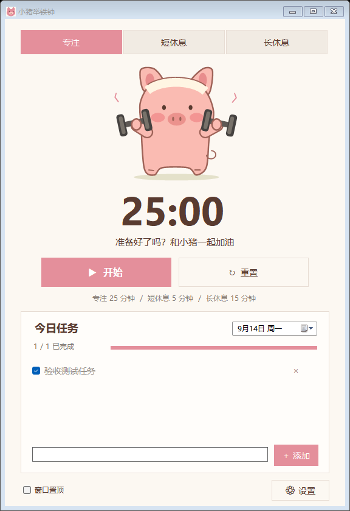
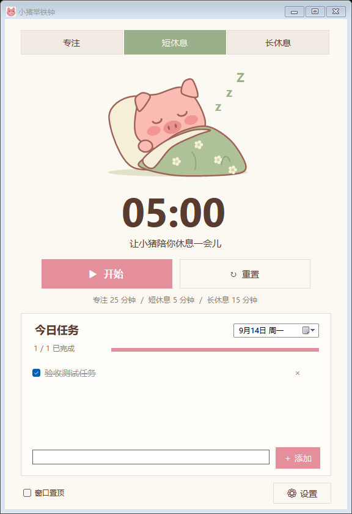
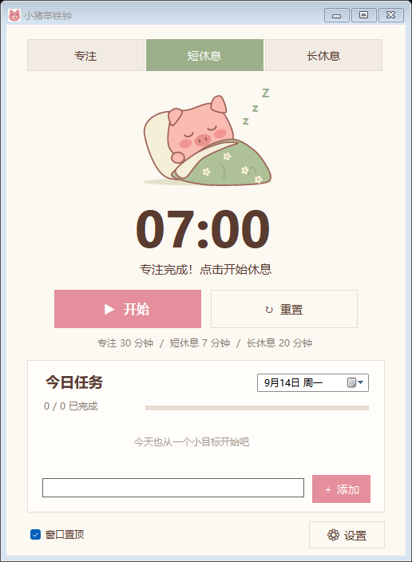

# 🐷 小猪举铁钟 · Pig Lift Clock

**专注时一起举铁，休息时一起盖被。**

一个中文 Windows 桌面番茄钟，把专注计时、可爱的小猪动画和每日任务清单放进同一个轻量窗口。下载 EXE 即可运行，任务保存在本机，无需注册账号。


## 界面预览

下面是**实际运行截图**。当前版本采用奶油白与浅粉色配色，使用直角按钮和任务面板；小猪由代码绘制，运行时会随计时状态播放动画。

| 专注：小猪举铁 | 休息：小猪盖被 |
| :---: | :---: |
|  |  |

> 截图中的任务仅为演示数据。首次打开程序时，任务清单为空。

## 下载与运行

1. 打开本仓库右侧的 **Releases**，进入最新版本。
2. 在 **Assets** 中下载 `PigLiftClock.exe`，或下载包含中文说明的 `PigLiftClock-v1.0.0-windows.zip`。
3. 如果下载的是 ZIP，请先解压，再双击 `PigLiftClock.exe`。
4. 选择“专注”，点击“开始”，和小猪一起完成第一个专注周期。

无需安装 Python、Node.js 或开发工具。EXE 使用 Windows 的 **.NET Framework 4.x**；如果系统缺少相应运行环境，需要先启用或安装该组件。

**建议使用 Windows 10 / 11。** 当前版本已在开发所用 Windows 环境验证，没有完成所有系统版本、DPI 和多显示器组合的兼容性测试。

## 功能一览

| 功能 | 使用方式 |
| --- | --- |
| 专注计时 | 默认 25 分钟，运行时小猪循环举哑铃 |
| 短休息 | 默认 5 分钟，小猪盖被睡觉 |
| 长休息 | 默认 15 分钟，每完成 4 次专注后准备长休息 |
| 自定义时长 | 三种模式分别支持 1–180 分钟 |
| 开始 / 暂停 / 继续 / 重置 | 暂停同时停止动画，重置恢复当前模式的完整时长 |
| 到点提醒 | 弹窗提示，可在设置中关闭提示音 |
| 每日任务 | 添加、勾选完成、删除任务，显示完成进度 |
| 按日期管理 | 查看和修改历史日期，也可提前安排其他日期 |
| 自动保存 | 任务、时长、声音开关和置顶设置保存在本机 |
| 窗口置顶 | 勾选后显示在其他普通窗口上方 |
| 托盘恢复 | 最小化后继续计时，双击托盘图标恢复窗口 |
| 单实例 | 重复启动时提示已有程序运行 |

## 如何使用番茄钟

### 1. 开始一轮专注

选择顶部“专注”，点击“开始”。倒计时开始，小猪开始举铁。可以先在任务清单中写下本轮要完成的小目标。

- **暂停**：保留剩余时间，小猪暂停运动。
- **继续**：从暂停的位置恢复。
- **重置**：停止当前计时，回到该模式的完整时长。
- **切换模式**：运行中切换会询问是否重置；确认后进入所选模式。

### 2. 到点后休息

专注结束时，程序弹窗提醒，并准备休息计时。**下一阶段不会自动开始**，需要点击“开始”。这样可以等你处理完手头的收尾工作，再正式休息。

休息结束后，程序准备下一轮专注。每完成 4 次专注，会准备一次长休息；该轮次计数在退出程序后重新开始。

```text
专注完成 → 短休息 → 专注完成 → 短休息
         → 专注完成 → 短休息 → 第 4 次专注完成 → 长休息

每次进入下一阶段，都由你点击“开始”。
```

### 3. 调整时间与声音

点击右下角“设置”，或点击主界面的时长说明。

| 设置 | 默认值 | 可调范围 |
| --- | --- | --- |
| 专注时长 | 25 分钟 | 1–180 分钟 |
| 短休息时长 | 5 分钟 | 1–180 分钟 |
| 长休息时长 | 15 分钟 | 1–180 分钟 |
| 到点提示音 | 开启 | 开启 / 关闭 |

保存设置会重置当前计时。关闭提示音后仍会显示到点弹窗。

## 如何管理每日任务

1. 在任务面板底部输入任务文字。
2. 点击“添加”，或按 **Enter**。每条任务最多 200 字。
3. 完成后勾选左侧复选框，任务文字会显示删除线，完成进度同步更新。
4. 点击任务右侧的 **×** 删除该项。
5. 使用面板右上角的日期选择器，查看或编辑其他日期。

删除操作没有撤销按钮，点击前请确认选中的是要删除的任务。过长文字会在列表中省略，将鼠标停留在任务上可查看完整内容。

跨过午夜时，如果当前显示的是“今天”，程序会自动切换到新的一天；如果正在查看其他日期，则继续保留该日期。历史任务不会因为跨天而自动删除。

## 小窗口与桌面使用



- 拖动窗口边缘可以调整大小，任务较多时列表可以滚动。
- 勾选左下角“窗口置顶”，便于工作时查看倒计时。
- 点击标题栏“最小化”后，计时会继续。
- 双击系统托盘的小猪图标恢复窗口，也可右键图标选择“显示小猪举铁钟”。
- 点击标题栏 **×** 或托盘“退出”会退出程序，并保存任务与设置。

**关闭软件、电脑关机或休眠时，不会即时发出提醒。** 程序保持运行并从休眠恢复后，会按当前时间检查是否已经到点。退出后重新启动，计时从所选模式的完整时长重新开始，不恢复上一次剩余时间。

## 数据保存与迁移

程序数据不放在 EXE 旁边，而是保存在当前 Windows 用户的本地应用数据目录：

```text
%LOCALAPPDATA%\PigLiftClock\
├── data.xml       # 当前任务和设置
└── data.xml.bak   # 上一次替换保存时保留的备份
```

在文件资源管理器地址栏粘贴 `%LOCALAPPDATA%\PigLiftClock` 即可打开。

### 更新程序

退出旧版本，再运行新版本 EXE。只要仍使用同一 Windows 用户，程序会读取原有数据，不需要手动导入。圆角旧版和直角新版也使用同一数据目录。

### 迁移到另一台电脑

1. 先关闭程序。
2. 复制 EXE，以及 `data.xml` 和存在的 `data.xml.bak`。
3. 在新电脑对应用户的 `%LOCALAPPDATA%\PigLiftClock` 下放入数据文件。
4. 启动程序检查任务与设置。

### 保存失败或文件损坏

程序采用临时文件加原子替换保存，并保留上一份备份。主文件损坏且备份可读时，会从备份恢复并提示。如果文件无法恢复，程序会报告启动错误，不会直接以空清单覆盖它。

遇到保存失败时，请先保留窗口内的任务，检查磁盘空间和目录权限。修改或恢复数据前建议先复制整个数据文件夹。

## 常见问题

### 为什么下载 ZIP 后找不到 EXE？

GitHub 自动提供的 `Source code (zip)` 是源码压缩包。请下载 Release 的 **Assets** 中单独上传的 `PigLiftClock.exe` 或 `PigLiftClock-v1.0.0-windows.zip`。

### 为什么点击开始后还是不能计时？

先确认没有打开设置或到点提示弹窗，并检查按钮是否显示“暂停”。如果程序提示已经运行，请查看任务栏和系统托盘，恢复已有窗口。

### 为什么第二天看不到昨天的任务？

清单按日期显示。点击日期选择器切回昨天即可查看。

### 为什么关闭声音后还有提示？

声音开关只决定是否播放到点提示音，弹窗仍会保留，避免错过专注或休息结束。

### 这是安装程序吗？

不是。它是可直接运行的 EXE，没有安装向导。需要的 .NET Framework 由 Windows 提供或单独启用。

### 有云同步、开机自启或后台服务吗？

当前版本没有。数据仅保存在本机，程序需要保持运行才能计时和提醒。

### 为什么小猪与最初效果图略有不同？

最初效果图用于确定配色和布局，正式程序采用 C# 矢量绘制，以便缩放和播放动画。当前 Release 采用直角界面，并使用实色背景应用图标。

## 从源码构建

### 环境

- Windows。
- Windows PowerShell。
- .NET Framework 4.x C# 编译器 `csc.exe`。

无 NuGet、npm 或 Python 依赖。构建脚本使用系统中的 .NET Framework 编译器。

在项目根目录执行：

```powershell
powershell -NoProfile -ExecutionPolicy Bypass -File .\build.ps1 -OutputPath .\dist\PigLiftClock.exe
```

输出文件为 `dist\PigLiftClock.exe`。图标已嵌入 EXE，分发时无需附带 `src` 或其他 DLL。

### 项目结构

```text
src/
├── Core.cs          # 倒计时、任务模型、XML 持久化与备份
├── Artwork.cs       # 小猪动画、配色、自绘按钮和任务面板
├── MainForm.cs      # 主窗口、任务清单、设置与到点提醒
├── Program.cs       # 应用入口、单实例检查与启动错误处理
└── app.ico          # 应用图标
docs/images/         # README 实际界面截图
tests/               # 核心测试与 WinForms 交互测试
build.ps1            # 编译脚本
README.md            # 项目介绍和完整使用文档
使用说明.md          # 随 Release 分发的快速说明
```

### 测试

核心测试覆盖暂停恢复、到期单次触发、任务和设置保存，以及损坏备份恢复。界面测试会打开独立测试窗口，操作按钮、任务、日期和设置，并检查到点提示、置顶与截图。

测试使用项目内的独立数据目录，不读取日常任务数据。运行步骤见 [tests/README.md](tests/README.md)。

## 反馈问题

请在本仓库 **Issues** 中描述操作步骤、预期结果、实际结果和 Windows 版本。遇到显示问题时，附上窗口截图会更容易定位；截图前可先隐藏个人任务内容。
